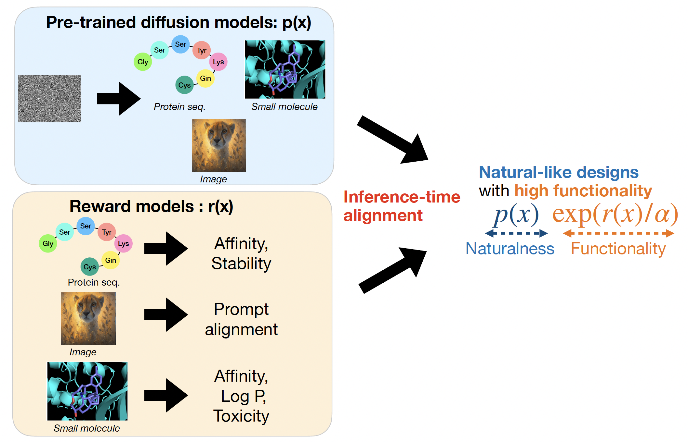
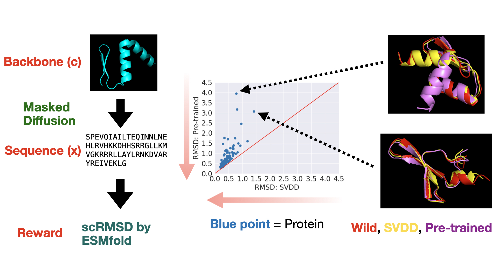
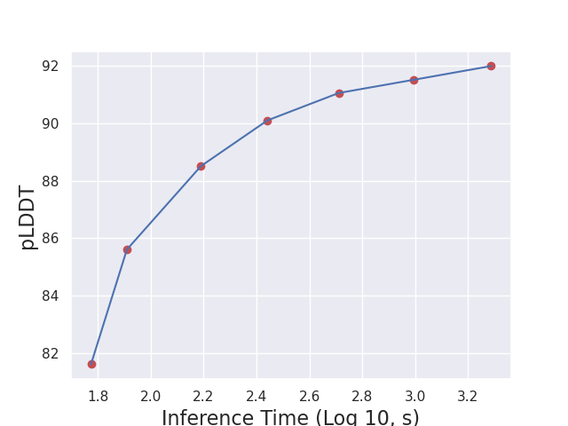

# Tutorial: Inference-Time Alignment in Diffusion Models for Protein Design 

This code is provided alongside the tutorial paper on inference-time alignment in diffusion models. The objective is to optimize multiple reward functions within a protein inverse folding model (p(x|c)), where $x$ represents a sequence, and $c$ denotes a backbone structure. For related refer to [small molecule](https://github.com/hyanan16/SVDD-molecule) or [images](https://github.com/masa-ue/SVDD-image). 



We employ an inverse folding model (mapping backbone structure to sequence) based on a discrete diffusion model as the foundational model. In this repository, we detail the process of optimizing various downstream reward functions in this diffusion model using inference-time techniques.

## How to Run 
Go to `./fmif` folder. Then, the inference-time technique can be run as follows.  

```bash 
CUDA_VISIBLE_DEVICES=1 python eval_finetune.py --decoding 'SVDD' --reward_name 'LDDT'  --repeatnum 10 --batchsize 5
```

<!---
``` 
CUDA_VISIBLE_DEVICES=5 python eval_finetune.py --decoding 'DDBFS' --reward_name 'LDDT'  --repeatnum 5 --batchsize 5 --wandb_name w5d3-expo-expo2
```
-->

* **--decoding**: 
  * **SMC**: Refer to Sec. 3.1 or papers . 
  * **SVDD** (a.k.a. value-based sampling): Sec. 3.2 or the paper 
  * **NestedIS**: Refert to Sec. 3.3
  * **Classifier guidance**: Refer to Sec. 5.2  or the paper such as  
* **--rewards**:  
  * **stability**: This is a reward function trained in [Wang and Uehara et al., 2024](https://arxiv.org/abs/2410.13643), which predicts Gibbs’s free energy from a sequence and a structure on the [Megalscale dataset](https://www.nature.com/articles/s41586-023-06328-6). For details, refer to the [code](https://github.com/ChenyuWang-Monica/DRAKES).  
  * **pLDDT**: A common metric to characterize the confidence of prediction. It has been used as a specific proxy of stability. 
  * **scRMSD**: $\|c- f(\hat x) \|$ where $f$ is a forward folding model ([ESMfold](https://github.com/facebookresearch/esm)). While the pre-trained model is already a conditoinal diffusoin model, this is considered to be usesful to robustify the generated protein further. 
  * .... (Will be added more)
*  **--repeat_num**: When using SMC, SVDD, and Nested IS, we need to choose the duplication hyperparameter.
* **--batchsize**: Batch size  
* **--alpha**: We set this as $0.5$ in SMC and classifier guidance by default. For SVDD, we choose $0.0$ by default. 
 


## Outputs  

We condition several wild backbone structures in validation protein datasets. We save each generated protein as a pdb file in the folder `./sc_tmp/`. We also record several important statistics in a pandas format in the folder `./log`. 


## Results 

Each blue point corresponds to the median RMSD of generated samples for each backbone structure. For example, when optimizing scRMSD, for some proteins, while naive inference procedures have certain inconsistency, the inference-time technique can make the generated result very consistent with the forward folding model.  




## Inference-Time Scaling Law 

The performance improves as the computational budget increases. The following illustrates a case where the beam width increases when runinng value-based beam search (SVDD). While this increases computational time, it leads to a significant improvement in performance.




## Installation 

* The pre-trained model is based on the code in multiflow code [Campbell & Yim et al., 2024](https://github.com/jasonkyuyim/multiflow). 
* Then, to introduce weights on pre-trained models, run 
```bash 
python download_model_data.py
```
Then, the dataset will be placed on the folder `./datasets`
* To calculate the energy, we need to install [Pyrosseta](https://www.pyrosetta.org/). 
* Note that our code also builts on [ESMFold](https://github.com/facebookresearch/esm), [OpenFold](https://github.com/aqlaboratory/openfold) and [ProteinMPNN](https://github.com/dauparas/ProteinMPNN).

## Citation 

If you use this codebase, then please cite
```
@misc{uehara2025rewardguidedcontrolledgenerationinferencetime,
      title={Reward-Guided Controlled Generation for Inference-Time Alignment in Diffusion Models: Tutorial and Review}, 
      author={Masatoshi Uehara and Yulai Zhao and Chenyu Wang and Xiner Li and Aviv Regev and Sergey Levine and Tommaso Biancalani},
      year={2025},
      eprint={2501.09685},
      url={https://arxiv.org/abs/2501.09685}, 
}
```

